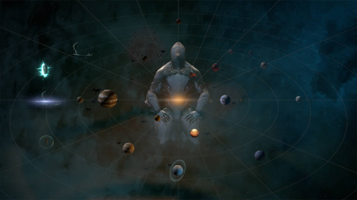

{ width="300" align=right }

# Starchart

The [Star Chart](https://wiki.warframe.com/w/Star_Chart). **Absolute priority for new players**: progress/advance in your star chart by unlocking each point on the map.

!!! note "Unlocked Starchart = faster farm"
    The most "profitable" areas are not accessible right away, to get more resources/credits/Endo it is essential to advance on the chart.

Advancing in the Star Chart and unlocking junctions between planets gives:

- **account Mastery XP** to access more material
- access to **quests** giving frames, weapons and game info
- new **mods / weapon blueprints** offered at planet junctions
- unlocking the entire Star Chart gives **access to hard mode** (Steel Path), with more challenges and even stronger tools to blow everything up.
- some points on it are hidden behind quests, remember to **do your main quests** (especially [The Second Dream](https://wiki.warframe.com/w/The_Second_Dream) and [The War Within](https://wiki.warframe.com/w/The_War_Within))

-----------------

## Solo or Multi
You can select different game modes in the navigation at the top left, the icon next to your glyph:

- public (multi)
- friends only
- invite only
- solo

When the content seems difficult, having company can be a plus.
When you want to understand everything that's happening and advance at your own pace, playing solo is also suitable.

-----------------

## Junctions
Real treasure chests for beginners, they give you mods, blueprints, quests themselves unlocking content...

Tips to make junction battles easier by starter (remember to level your [mods](../mods/index.md)):

- __Excalibur__: [Radial Blind](https://wiki.warframe.com/w/Radial_Blind) (2nd ability) opens enemies to finishers, allows to completely trivialize combat
- __Volt__: [Electric Shield](https://wiki.warframe.com/w/Electric_Shield) (3) to shoot safely at range or [Speed](https://wiki.warframe.com/w/Speed) to destroy in melee
- __Mag__: [Magnetize](https://wiki.warframe.com/w/Magnetize) (2) trivializes combat: enemy bullets turn against them and your bullets gain a damage bonus. [Polarize](https://wiki.warframe.com/w/Polarize) if you want to reduce defenses

-----------------

## Open Worlds

!!! note "Beginner trap"
    Beginner trap: you access them very early but at the very beginning the content is too hard and there are other priorities. Come back later when you've unlocked more planets, unlocked material and leveled up your equipped [mods]().

- **Deimos**, Cambion Drift: open-world to prioritize among the 3.
    - missions are accessible
    - gives access to:
        - the [helminth](https://wiki.warframe.com/w/Helminth_System)
        - [Panzer Vulpaphyla](https://wiki.warframe.com/w/Panzer_Vulpaphyla) (excellent companion)
        - the loot boost mod [Prosperous Retriever](https://wiki.warframe.com/w/Resourceful_Retriever)
        - excellent [melee mods](../mods/weapons.en.md/#melee-weapons)
        - [Cedo](https://wiki.warframe.com/w/Cedo) (excellent AoE pump with status)
- **Cetus**, Earth: do not prioritize, unless you want to obtain Gara. Difficult missions, advance in the Star Chart first.
- **Fortuna**, Venus: do not prioritize. Difficult missions, advance in the Star Chart first.

-----------------

## Movement

- **Teleport**: open the map (default M key, otherwise change your shortcuts) by pressing M for a few seconds, then select by clicking the large white icons on the map
- **K-drive**:
    - received after completing Fortuna's introductory quest on Venus
    - requires adding to your consumable wheel in your Arsenal (2nd tab)
    - once in open-world, open the consumable wheel (A or Q) and select for deployment
- **Archwing**: ultimate comfort
    - do the [Archwing](https://wiki.warframe.com/w/The_Archwing) quest
    - build an [Archwing Launcher](https://wiki.warframe.com/w/Archwing_Launcher) and equip it in your [consumables](https://wiki.warframe.com/w/Arsenal#Gear) wheel
    - once in open-world, open the consumable wheel (A or Q) and select for deployment
    - remember to add the consumable among the first 12 and put it on a direct shortcut key