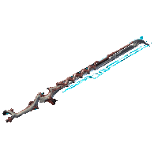

{ width="180" align=right }

# Beginner Weapons

List of useful / priority weapons if you don't know what to choose and/or don't have a favorite among what you've collected along the way.
The MR (Mastery Rank) listed corresponds to the level required to access it, it is not indicative of the weapon's power.
Weapons in **bold** are a cut above the others.

Quest weapons are especially helpful since they come with a free [catalyst](https://wiki.warframe.com/w/Orokin_Catalyst) equipped thus providing double the capacity for mods right away. More room for your mods!

- MR 0:
    - Market: [Braton](https://wiki.warframe.com/w/Braton), [Skana](https://wiki.warframe.com/w/Skana)
    - Quest: [**Broken War**](https://wiki.warframe.com/w/Broken_War), [**Nataruk**](https://wiki.warframe.com/w/Nataruk), [Thornbak](https://wiki.warframe.com/w/Thornbak)
    - **Kitguns**:
    - Duviri:
- MR 1:
    - Market: [Strun](https://wiki.warframe.com/w/Strun)
- MR 2:
    - Market: [Boltor](https://wiki.warframe.com/w/Boltor), [Orthos](https://wiki.warframe.com/w/Orthos)
- MR 3:
    - Quest:
- MR 4:
    - Quest: [**Xoris**](https://wiki.warframe.com/w/Xoris)
    - Market: [Hek](https://wiki.warframe.com/w/Hek), [Aklex](https://wiki.warframe.com/w/Aklex)
    - Dojo: [Guandao](https://wiki.warframe.com/w/Guandao), [Nukor](https://wiki.warframe.com/w/Nukor)
- MR 5:
    - Market: [**Atomos**](https://wiki.warframe.com/w/Atomos)
    - Dojo: [Ignis](https://wiki.warframe.com/w/Ignis)
    - Kuva/Tenet Liches:
- MR 6:
    - Market: [Soma](https://wiki.warframe.com/w/Soma)
- MR 7:
    - Dojo: [Cerata](https://wiki.warframe.com/w/Cerata)
- MR 8:
    - Reputation: [**Cedo**](https://wiki.warframe.com/w/Cedo) on [Deimos](https://wiki.warframe.com/w/Entrati) from the [Father](https://wiki.warframe.com/w/Father)
- MR 9:
    - Dojo: [Ignis Wraith](https://wiki.warframe.com/w/Ignis_Wraith)
