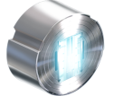

{ width="90" align=right }

# Platines

## **Infos générales**

Principe de base = choper des objets/mods/reliques rares le plus rapidement possible. 
Avoir un booster doubleur de ressources aide pour certaines farm, comme l'ouverture de reliques ou le farm de plantes pour les apothiques.

!!! note "Pour les débutants"

    Sert surtout pour les emplacements au début du jeu, le reste viendra plus tard (cosmétiques, trade)
    Le jeu vous offre quelques plats à la création de votre compte, à dépenser dans la boutique : il faut les dépenser dans des emplacements en priorité.
    Les plats viendront d'échanges avec d'autres joueurs, la quantité d'échanges par jours est égale à votre [rang de maîtrise](beginner/mastery-rank.md).

!!! note "Trouver / identifier une méthode de farm"

    - trouver des objets se vendant cher sur le [warframe.market](https://www.youtube.com/watch?v=-voGeqWi_BU&pp=ygUPd2FyZnJhbWUgbWFya2V0) ou sur les chats d'échange ingame anglophones (beaucoup plus de monde)
    - trouver des méthodes pour récupérer ces objets rentables de manière efficace / rapide / qui vous plait (favoriser les farms croisés, ex : choper des plantes pour apothique en ouvrant des reliques en public)
    - consulter les listes communautaires [1](https://www.youtube.com/results?search_query=warframe%20plat), [2](https://www.youtube.com/watch?v=6flivfmd-JU), [3](https://www.youtube.com/watch?v=Pikxp0npJSM), [4](https://www.youtube.com/watch?v=Tgw8swKlC3s), [5](https://www.youtube.com/watch?v=5ryAfjOxp7E)

## **Lieux d'échanges**

- [warframe.market](https://warframe.market) : a l'avantage de permettre de vendre très vite et de continuer vos missions le temps de trouver un vendeur qui vous enverra un message
- ??? note "onglet "échanges" dans le chat du jeu"
    - bazar en désordre total. Les prix varient énormément, moyen de gagner plus qu'au market mais demande plus de temps, d'attention et de tchatche
    - privilégier le jeu en anglais (option launcher) + serveur anglais (options de connexion en jeu) pour accéder au canal d'échange ayant le plus de joueurs
    - la loupe en haut à gauche du chat permet de filtrer les textes affichés pour ne pas se noyer
    - glossaire rapide : "WTB" = Want To Buy, "WTS" = Want To Sell
    - vous pouvez ajouter un lieu de l'objet en ouvrant un crochet [ puis en commençant à écrire son nom et choisir dans l'auto-complétion. Rapide, efficace, on saura ce que vous vendez sans erreur.

Les échanges finaux après contact se feront de préférence dans un dojo à un pad d'échanges. En dernier recours vous pouvez passer par le bazar de Maroo et utiliser l'emote d'échange.

Quelques méthodes / sources, pour le reste checker [Contenu](content.md) :

- ouvrir des [reliques](relics.md)
- ??? note "mods apothiques"
    - faire la [quête de Titania](https://wiki.warframe.com/w/The_Silver_Grove) pour obtenir les blueprints d'apothiques
    - farmer les plantes qui vous intéressent (voir [ingrédients apothiques](https://wiki.warframe.com/w/Apothic))
        - [Grineer Forest](https://wiki.warframe.com/w/Grineer_Forest), Mantle (Terre, capture)
            - Nuit : Saracénie Crépusculaire, Moonlight Dragonlily, Moonlight Jadeleaf
            - Jour : Treshcone de jour
        - Lua : Lunar Pitcher
        - [Grineer Settlement](https://wiki.warframe.com/w/Grineer_Settlement), **Mars** au sol : Ruk's Claw
        - [Grineer Asteroid](https://wiki.warframe.com/w/Grineer_Asteroid), **Mercure**/Phobos/Saturne/Uranus : Vestan Moss
        - [Corpus Outpost](https://wiki.warframe.com/w/Corpus_Outpost), **Venus**/Neptune/Pluton (alétoire) : Frostleaf
    - fabriquer vos apothiques à l'avance
    - former un groupe, 1 Khora + 3 Nekros de préférence
    - run Mantle (Terre) pour cherche le [Silver Grove Shrine](https://wiki.warframe.com/w/Silver_Grove_Shrine) : le lotus parle quand vous rentrez dans le bon tileset
    - utiliser vos buff loot et ouvrir 2 apothiques chacun
- ??? note "mods corrompus"
    - check [page wiki](https://wiki.warframe.com/w/Category:Corrupted_Mods) et [video explicative](https://www.youtube.com/watch?v=f_g2lb_jTeQ)
    - vous en aurez besoin pour vos builds
    - vous vendez le surplus pour des plats
    - se farm sur Deimos, de préférence une carte rapide comme la capture sur [Horend](https://wiki.warframe.com/w/Horend)
        - nécessite d'équiper des clés corrompues, une aléatoire sur 4 possibles est nécessaire pour ouvrir une porte d'une salle au trésor. Répartir les clés entre les joueurs présents ou partir seul avec toutes les clés équipées
        - les plans des clés se trouvent dans les dojo : rejoindre un clan et aller dans le labo orokin
        - possible de faire les runs en solo, de préférence avec une frame rapide (titania/nezha)
        - conseillé de faire les runs en groupe : réduit la charge des clés et accélère les runs pour trouver les portes
- farm Aya Cetus (groupe) ou Deimos (Brute Force rang max solo ou à 2
- farm [apothiques](https://www.youtube.com/results?search_query=apothic%20warframe) (mod Growing Power & autres)
- farm [Captain Vor](https://www.youtube.com/watch?v=6DH_xGhMAfg)
- farm endurance Steel Path :
        -  Cascade + booster mod si possible (+ drops arcanes)
        -  Défense
        -  Perturbation/Disruption (Kappa)
        -  [Arbitrage](https://www.youtube.com/watch?v=xegoFob-KhI&pp=ygUNd2FyZnJhbWUgcGxhdNIHCQnHCQGHKiGM7w%3D%3D)
        -  ...
- etc...

