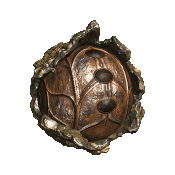
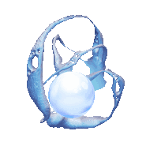
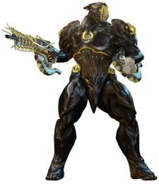
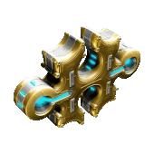

{ width="135" align=right }

# Reliques

Les reliques sont une ressource essentielle pour améliorer votre arsenal, les ouvrir est une activité importante pour beaucoup de joueurs !

## Ressources obtenues

{ width="75" align=left }

- **vestiges du néant** pour :
    - **raffiner** d'autres reliques (augmente les chances de drops rares)
    - fabriquer vos **clés corrompues** pour le farm de [mods corrompus](plats.md/#bons-plans)
    - votre **limite maximum** de vestiges du néant dépend de votre [niveau de maîtrise](../beginner/mastery-rank.md)
    - **pensez à dépenser vos vestiges** (clés du néant, raffinage de relique) avant d'arriver au maximum pour ne rien perdre, ils ne se stockent pas au-delà de votre limite maximum

{ width="75" align=left }

- **plans d'objets "prime"** plus puissants et rares :
    - gardez ceux qui vous intéressent
    - doublons, surplus :
        - les convertir en *ducats* chez le Baro, acheter mods primes & autres
        - les vendre pour des [Plats](plats.md), de préférence en lots complets (ex : les 4 pièces d'une frame en une vente)

{ width="75" align=left }

- **schémas de forma** :
    - doivent être fabriqués **toutes les 24h**
    - permettra de **booster votre matériel** en donnant plus de place de mods : vous n'en aurez jamais assez, toujours avoir un forma en cours de construction. Utiliser l'app compagnon si besoin

??? note "Stratégie ouverture de reliques"

    - faire une frame de rush relique (Gauss, Titania + helmint gauss, Volt ou autre)
    - utiliser [AlecaFrame](https://alecaframe.com/) si tu es sur PC pour mieux comprendre les valeurs des drops de reliques et gérer tes ventes
    - favoriser les runs rapides (capture, exter) et le néant (bonus drop relique) : **Hepit, Ukko, Oxomoco, Teshub**
    - drop relique rapide :
        - Lith : Hepit dans le Néant
        - Meso / Neo : Ukko dans le Néant
        - Axi : Apollo sur Lua
    - trouver des groupes relique :
        -  le discord Burner ([cf contenu/Discord](../content.md/#discord))
        -  le canal public pour ouvrir des reliques en groupe (jeu en anglais, serveur EU ou amérique)
    - penser à ne jamais être capé en traces du néant (monter en rad / flawless un stock en continu), sinon les drops de nouvelles traces/réactifs seront perdus

---------------

## **Obtenir des reliques**

- **Sources communes :**
    - espionnage
    - mission endless (défense, survie, perturbation, excavation, etc...)
    - toute mission dans le Néant
- **Sources les + rapides :**
    - Lith : Hepit dans le Néant
    - Meso / Neo : Ukko dans le Néant
    - Axi : Apollo sur Lua
- **Packs de reliques :** 
On peut acheter chez certains syndicats des packs de 3 reliques aléatoire, très bonne source. La réputation peut être stockée en vue de sorties de nouvelles frames prime.
    - [syndicats de base](syndicates.md/#syndicats-de-base)
    - [syndicats open-world](syndicates.md/#syndicats-open-world)
    - boutique de Teshin en relais ([Steelpath - essences d'acier](../steelpath/index.md/#essence-dacier))

---------------

## **Rareté des reliques**

Utiliser la [page des prime qui n'ont pas encore été vault](https://wiki.warframe.com/w/Prime_Vault#Not_Yet_Vaulted) : les reliques en contenant sont considérées comme communes, sauf si sortie très récente.
Certaines reliques sont plus intéressantes que d'autres, un mix entre la rareté et la popularité des parties primes :

- **nouvelle frame prime** : l'arrivée d'une nouvelle frame prime fait monter énormément les prix surtout sur les premières heures/jours/semaines, le prix baissera avec la baisse de la rareté.
    - penser à monter les syndicats en avance pour acheter des reliques à la sortie de la nouvelle frame
- ??? note "Parties primes vaultées"
    - [page wiki Prime Vault](https://wiki.warframe.com/w/Prime_Vault)
    - il n'y a qu'un quantité limitée de frames et armes prime disponibles à un moment donné, celles indisponibles montent en prix car rares
    - chaque fois qu'une nouvelle prime sort, une autre plus ancienne est vault. La rotation actuelle consiste en 7 warframes primes non-vaultées (et les armes/sentinelles qui vont avec)
        - consulter la [page unvaulting](https://wiki.warframe.com/w/Prime_Vault#Not_Yet_Vaulted) pour voir les reliques "communes" du moment

- ??? note "2 sources de reliques vaultées"
    - **posséder une vieille relique** drop lorsqu'une frame/arme était accessible dans le passé
    - **dépenser de l'[Aya](https://wiki.warframe.com/w/Aya)** pour acheter dans la boutique de [Résurgence Prime](https://wiki.warframe.com/w/Prime_Resurgence) :
        - accès rapide boutique Aya : orbiteur > market > menu déroulant en haut à gauche > avant-dernière option "Résurgence Prime", trier par reliques
        - gagner de l'Aya : 
            - plus ou moins mêmes sources que les [reliques](relics.md/#obtenir-des-reliques)
            - mises à prix en open-world, plus ou moins rentables, dont 2 méthodes en particulier :
            - [Brute Force](https://www.youtube.com/watch?v=rfV_KoJGvPI) sur Deimos (le + accessible), à faire en solo ou à 2 (certains objectifs deviennent trop longs à 3 et 4 joueurs)
            - [Bounties opti sur Cetus](https://www.youtube.com/watch?v=eovwUJXV6Ow) sur Cetus (+ rentable mais inaccessible pour un nouveau joueur, à réserver en groupe pour [plus tard](../content.md/#discord))

---------------

## **Ouvrir des reliques**

### **Méthode : comment faire**

2 types de farm :

- **pick-up pur / random** : ouvrir des reliques aléatoires sans faire de groupe à l'avance
    - permet de bénéficier aléatoirement de drops d'alliés
    - permet de monter votre stock de traces du néant pour monter vos "bonnes" reliques
    - privilégier les missions rapides (capture, exter, sabotage)
- **farmer en groupe organisé** où chacun amène la même relique pour augmenter les chances de drop spécifiques
    - passer par un discord communautaire
    - ??? note "passer par le canal de recrutement du jeu"
        - mettre le jeu en anglais (plus de monde) via le launcher
        - régler les paramètres pour les serveurs états-uniens (plus de monde)
        - utiliser le canal de recrutement
        - cliquer sur la loupe en haut à gauche du canal : trier par les noms de reliques vous intéressent (réduit le spam)
        - utiliser les liens d'objets in-game (ouvrir les crochets [ ], commencer à écrire le nom, utiliser l'auto-complétion)
        - éviter les reliques impeccables/flawless vu le peu de volume disponible (soit intactes pour les loots bronze, soit radiante pour les loots argent/or)
        - types de messages :
        - **H [Relic Axi V8] 2/4 rad** : veut dire **H**ost (hôte/créé un groupe) pour la relique Axi V8, déjà 2 joueurs sur 4, relique radiante pour tous ==> vous lui envoyez un message "**+1**" / "**inv**" pour être invité
        - **L [Relic Axi V8]** ou **LF [Relic Axi V8]** : veut dire **L** looking for group, joueur seul cherchant un groupe. Parfois on peut être contacté pour créer un groupe quand on envoie ce genre de message
        - pensez à garder le menu ouvert (echap) pour garder un oeil en haut à gauche sur les reliques équipées et être sûr que tous les jours ont la bonne relique (et intacte/radiante pour tous selon), sinon refaites un groupe 

### **Meilleurs spots**
Privilégier les cartes pour leur rapidité et/ou la capacité à cumuler d'autres farms :

!!! note "Fissure lith : Echo de Bifrost, Proxima de Venus (railjack)"
    Avantages :

    - vous pouvez inviter des joueurs dès qu'ils ont un archwing (quête jonction de Mars)
    - drops reliques lith (+ pseudo-vault Nyx/Valkyr)
    - drop ressources rares (cellules orokin, tellures)
    - drop crédits élevés (relativement au niveau de jeu)
    - drop [Athodai](https://wiki.warframe.com/w/Athodai)

    Strat :

    - envoyer un joueur au "point blanc" indiquant une épave (nécessite [rang 5 en intrinsèques de Pilotage](https://wiki.warframe.com/w/Railjack/Intrinsics#Piloting) pour le voir) avec un hack au fond d'un couloir (loot bonus Athodai & reliques Nyx/Valkyr)
    - faire la partie railjack très courte (détruire le vaisseau ennemi avec canon principal)
    - se garer en face / un peu au-dessus de l'entrée du vaisseau (accès facile pour tous)
    - rush l'extermination (aoe + course rapide, ex : Titania helminth gauss)
    - tout le monde doit se coller à la porte de sortie (pour valider la fin de mission)
    - revenir au railjack
        - éviter d'utiliser l'archwing
        - utiliser [Form Up](https://wiki.warframe.com/w/Form_Up) pour tp tout le groupe
        - utiliser Omni (roue des consommables, équipé auto en railjack) pour tp solo (nécessite [Rang 4 en intrinsèques de Tactique](https://wiki.warframe.com/w/Railjack/Intrinsics#Tactical))

!!! note "Fissure requiem : Pago - Spy Kuva"
    - suivre le build et la strat expliqués sur cette [vidéo de GazTTV](https://www.youtube.com/watch?app=desktop&v=eKv-KUJmtG8)
    - taux élevé de [drops de mods 60/60](https://wiki.warframe.com/w/Pago)
    - espionnage haut-niveau : drops de meso/neo garanti
    - ouverture de reliques requiem : 
        - drops de mods requiems
        - raffiner en Impeccable (50 traces) pour optimiser

!!! note "fissure Axi/Neo : capture/exter dans le Néant (Hepit, Ukko, Oxomoco, Teshub)"
    - missions rapides & faciles
        - couloirs larges
        - design épuré : chargement rapide
        - chaque orbe dorée donne de l'énergie à vos frames prime
    - offre une relique à la fin de chaque mission
        - Hepit, Teshub : relique Lith
        - Ukko, Oxomoco : relique Meso / Neo
    - missions populaires : plus de joueurs pour avancer vite et partager les drops

