{ width="125" align=right }

# Ressources

Identifier les bons spots, utiliser les bons outils et jouer en groupe sera plus profitable.

Pour identifier les sources de [ressources](https://wiki.warframe.com/w/Resources) en jeu vous pouvez :

- survoler une ressource dans un blueprint de la fonderie, le texte vous donnera des infos
- cliquer dans la navigation sur une planète et en bas à droite accéder à l'interface d'extracteur de ressource, vous verrez les ressources basiques droppables sur la planète
- chercher votre ressource sur le [wiki warframe](https://wiki.warframe.com), voir [Références](../content.md) pour plus d'infos

---------------

## **Boosters**
Très importants, cumuler des **boosters** permettra d'obtenir beaucoup plus de ressources dans un même laps de temps.
Le  [booster de ressources](https://wiki.warframe.com/w/Resource_Booster) (orange) est le plus important, les autres ne valent pas le coût en plat à moins que vous ayez déjà une bonne entrée de [plats](plats.md), ce qui viendra plus tard.

Source de booster de ressources :

- [warframes de farm](../beginner/warframes.md/#frames-de-farm)
- [compagnons](../beginner/pets.md)
- market : [booster de ressources](https://wiki.warframe.com/w/Resource_Booster). Coûte des plats, après les emplacements est un achat prioritaire qui vous permettra d'accélérer votre farm de ressources ET votre farm de plats (cercle virtueux). Les boosters de 30j sont les plus rentables en coût/journée effective.
- [reliques endless](https://wiki.warframe.com/w/Void_Fissure#Endless_Missions) (survie, défense...) : cumule jusqu'à +100% chances de drops ressources
- booster de bénédiction d'un MR 30+ en relai (aller en relai pour afk / faire une pause et choper quelques bénés)

Si vous n'avez aucune booster ne desespérez pas. Le plus important est de savoir qu'ils existent pour vous donner un objectif à moyen-terme de les acquérir et en profiter plus tôt.

---------------

## **Spots de ressources**
Pour une liste synthétique consultez la **[page du wiki sur les lieux recommandés de farm](https://wiki.warframe.com/w/Resources#Recommended_Farming_Locations)**.

On ne verra que les ressources communes du début du jeu, pour plus de détail voir le [wiki, tableau des ressources](https://wiki.warframe.com/w/Resources#Resources_By_Planet).

L'interface d'extracteurs en bas à droite indique les ressources de la planète, par ordre d'abondance.
Chaque planète a un node "Dark Sector" avec un une icone différente et un booster de drops indiqué.

### **Communes**

{ width="60" align=left }

- _Nano Spores_
    - **early** : Deimos (mise à prix, Hyf (def), Terrorem (Survie))
    - Piscinas, Saturne
    - Oestrus, Eris : tileset avec 2 points jaunes indiqués, un gros hologramme bleu dans la salle de farm
    - Zabala, Eris : survie avec bonus loot

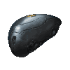{ width="60" align=left }

- _Plaques d'alliage_
    - **early** : Venus, partout
    - Draco, Ceres
    - Gabii, Ceres

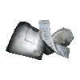{ width="60" align=left }

- _Salvage_ (récupération)
    - **early** : Mars, partout
    - Cameria, Jupiter

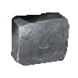{ width="60" align=left }

- _Ferrite_
    - **early** : Tikal, Terre / Apollodorus, Mercure
    - Survie / Défense, Néant

### **Inhabituelles**

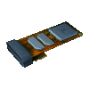{ width="60" align=left }

- _Circuits_
    - **early** : Venus, partout
    - Draco, Ceres
    - Gabii, Ceres

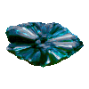{ width="60" align=left }

- _Cryotique_ missions [Excavation](https://wiki.warframe.com/w/Excavation)
    - **early** : Tikal, Terre

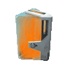{ width="60" align=left }

- _Hexenon_
    - L'idéal est d'utiliser des [extracteurs de ressource](https://wiki.warframe.com/w/Extractor) et de ne pas farmer directement pour gagner du temps
    - Survie, Jupiter

{ width="60" align=left }

- _Plastides_ 
    - **early** : Deimos, partout
    - Ophelia, Uranus
    - Assur, Uranus

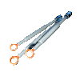{ width="60" align=left }

- _Pack Polymère_
    - **early** : Venus / Mercure, partout / Apollodorus, Mercure
    - Ophelia, Uranus
    - Assur, Uranus

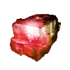{ width="60" align=left }

- _Rubedo_
    - **early** : Terre, partout
    - Survie / Défense, Néant
    - Zeugma, Phobos

### **Rares** 
!!! note "2 façon de farm les ressources rares"
    - **drop des ennemis** : favoriser des cartes denses, Défense/Survie en SteelPath ou à 4 joueurs en normal
    - **drops des caisses spéciales à casser** : 
        - utiliser frame AoE : Xaku / Limbo (spam 4 avec portée + énergie)
        - armes AoE 
        - équiper [Instinct Animal](https://wiki.warframe.com/w/Animal_Instinct) pour voir les caisses sur minimap si possible

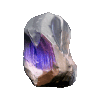{ width="60" align=left }

- _Cristal d'Argon_ 
    - Néant, partout. Indicateur minimap automatique lors d'un drop d'un allié.
        - spam de maps rapides en cassant des caisses : capture, exter dans le Néant (Ukko, Hepit, Oxomoco, Teshub)
        - missions longues : défense, survie (Taranis, Belenus, Ani, Mot)

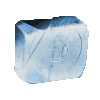{ width="60" align=left }

- _Gallium_ 
    - **early** : Mars, partout
    - Ophelia, Uranus
    
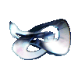{ width="60" align=left }

- _Morphics_ 
    - **early** : 
        - Apollodorus, Mercure
        - Mars, partout (Wahiba, Passe de Tyane)

{ width="60" align=left }

- _Capteurs neuronaux_
    - Themisto, Jupiter
    - Cameria, Jupiter
    - Naamah, Europa

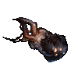{ width="60" align=left }

- _Neurodes_ 
    - **early** : 
        - Mariana / Tikal, Terre
        - Magnacidium / Terrorem, Deimos
    - Zabala, Eris
    - Yuvarium/Circulus, Lua

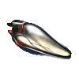{ width="60" align=left }    

- _Cellule Orokin_
    - **early** : Magnacidium, Deimos // Deimos, partout
    - Gabii / Draco, Ceres
    - Helene, Saturne

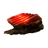{ width="60" align=left }

- _Tellure_
    - Ophelia, Uranus (Survie)
    - missions archwing / railjack

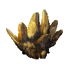{ width="60" align=left }

- _Oxium_ (tuer les drones oxium avant explosion ): 
    - Io / Elara, Jupiter
    - Apollo, Lua

### **Recherche** 

!!! note "2 sources d'obtention"
    - déjà construits : **prioriser les [invasions](https://wiki.warframe.com/w/Invasion)** 
    - sinon craft via les plans (chers, usage unique) du dojo + farm ressource intermédiaire

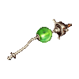{ width="60" align=left }

- _Ampoule de détonite_ 
    - Piscinas, Saturne

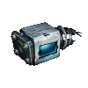{ width="60" align=left }

- _Echantillon de Fieldron_ 
    - Kelashin, Neptune

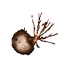{ width="60" align=left }

- _Echantillon Mutagène_ 
    - Terrorem, Deimos

---------------

### **Open-world**
Pêche, minage & conservation : sources de poissons, minerais & jetons.
Ne pas oublier votre animal pour le [double-drop](resources.md/#boosters). Une frame tanky anti-CC (rhino) voire invisible (Ivara, longue durée) rendra l'expérience plus agréable.

#### Pêche
!!! note "Pêche : détails"
    - Matériel :
        - récupérer le [matériel de pêche](https://wiki.warframe.com/w/Fishing#Gear) (lances, appats) chez [Hai-Luk](https://wiki.warframe.com/w/Hai-Luk) (Cetus), [Le Business](https://wiki.warframe.com/w/The_Business) (Fortuna) et la [Fille](https://wiki.warframe.com/w/Daughter) (Nécralisk)
        - équiper votre lance de pêche dans votre arsenal, roue des consommables
        - récupérer des [Luminous Dye](https://wiki.warframe.com/w/Luminous_Dye) sur Cetus pour bien voir les poissons
    - lieux & périodes de pêche par poisson : se référer à la [page wiki sur le pêche](https://wiki.warframe.com/w/Fishing)
        - [Spots Cetus](https://wiki.warframe.com/images/Fishingmap.png?059c6)
        - [Spots Fortuna](https://wiki.warframe.com/images/FortunaFishingMap.jpg?636d9)
    - dans l'open-world de votre choix :
        -  pensez à utiliser les appats si besoin
        - chercher les [hotspots](https://wiki.warframe.com/w/Fishing#/media/File:Warframe-Fish-Hotspot.gif) et utiliser vos [appats](https://wiki.warframe.com/w/Fishing#Gear) si besoin (achetable aux PNJ)
        - le filin d'**Ivara** au dessus d'un plan d'eau peut faciliter l'expérience
        - le passif de **Volt** permet de one-shot tous les poissons sans se préoccuper d'adapter votre lance

#### Minage
!!! note "Minage : détails"
    - seulement 2 couleurs de veines par open-world
    - acheter directement l'outil de minage à Fortuna (peut être amélioré, supérieur à celui de Cetus)
    - utiliser le tir secondaire avec l'outil de minage permet de zoomer comme avec un sniper
    - viser l'intérieur des "rectangles" pour de meilleurs drops. Plus petit/difficile est le rectangle plus grande sera la récompense.

#### Alternatives
!!! note "Farm alternatif rapide / mid-game"
    - **Fortuna** :
        - [Farm Itzal (archwing)](https://www.youtube.com/watch?v=rWcexHvD3rM) : caisses près des batiments et dans les "bunkers"
        - aller dans la grotte [Deck 12](https://wiki.warframe.com/w/Deck_12) pour miner : très peu d'ennemis et passer la "porte" dans la grotte permet de reset une partie de la grotte à l'infini
    - **Deimos** : 
        - [Farm Itzal (archwing)](https://www.youtube.com/watch?v=rWcexHvD3rM) : caisses dans les plus grosses grottes
        - Activer les [Obelisques](https://wiki.warframe.com/w/Cambion_Drift#Requiem_Obelisks), attendre que l'obelisk debuff les ennemis et les éléminer avec opérateur/necramech/passif Excalibur Umbra
