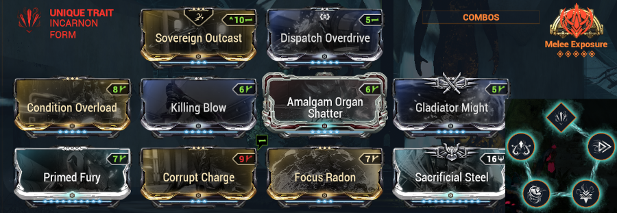
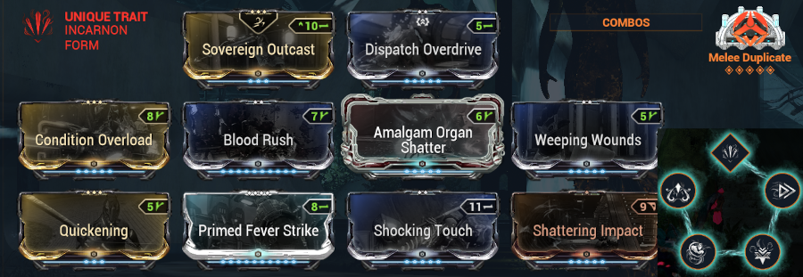

{ width="170" align=right }

# ACOLYTES
The [acolytes](https://wiki.warframe.com/w/Acolytes) are an important part of Steel Path:

- source of **2 new main resources**: Steel Essence and acolyte arcanes
??? note "acolytes: resource details"
    - Steel Essence
    - acolyte arcanes
        - will allow you to boost your builds with good first weapon arcanes
        - the surplus will allow you to get a variety of other arcanes via the [vosfor](https://wiki.warframe.com/w/Vosfor) with [Loid (original)](https://wiki.warframe.com/w/Loid_(Original))
- often the most **dangerous** element in Steel Path
??? note "acolytes: danger details"
    - they hit hard
    - resistant:
        - a unique damage reduction formula
        - resistant to many armor reduction sources
        - resistant to status effects: status are limited to 4 stacks maximum each
    - disruptive abilities:
        - **Violence** uses the skill [Silence](https://wiki.warframe.com/w/Silence) which disables your skills and prevents new casts
        - **Malice** launches [Mag's bubble](https://wiki.warframe.com/w/Magnetize) which can redirect your projectile damage back to you (or your allies / defense objectives...). Can be detached by rolling

---------------

## **Anti-acolyte Strategies**
[Video](https://www.youtube.com/watch?v=xMXQnPkZ5n8) with the essential info.

The acolyte damage reduction formula can be found on the [wiki](https://wiki.warframe.com/w/Acolytes), it is calculated based on a DPS metric dependent on the firerate sustained. No firerate, less damage reduction.

To mitigate the impact of acolyte damage reduction:

- **avoid** attacking them with a weapon having a lot of **firerate/multishot** (simple bullets/projectiles or beam/continuous attack)
- prioritize **high critical tiers** (100+ crit chance) which allow to partially ignore the attenuation
- prioritize **large damage instances** in few hits
- prioritize **AoE projectile** weapons (different calculation)
- prioritize **melee** weapons if possible (ignore firerate/multishot part as they have none)

### **Melee**
- AoE projectiles:
    - [glaives](https://wiki.warframe.com/w/Glaive_(Weapon_Type)): Glaive Prime, Xoris, Pathocyst, Cerata, Glaive Prime, Falcor, Cerata
    - zaws [Exodia Contagion](https://wiki.warframe.com/w/Exodia_Contagion): a rank 0 arcane suffices
- heavy slam: Magistar Incarnon, Fragor Prime, Arca Titron, Sampotes...
- weapons modded crit / heavy attack. Compatible stat-stick running speed or hybrid crit/status weapon: Praedos, Okina incarnon, Dual Ichor Incarnon...
- mod [Shattering Impact](https://wiki.warframe.com/w/Shattering_Impact) to consider if melee only for Acolytes
??? note "Praedos build Exposure / Duplicate"
    - **Exposure**, spam heavy attacks:
    
    - **Duplicate**, light attacks then heavy:
    

  
### **Ranged**
Mainly AoE projectile weapons:

- primaries: Arca Plasmor, Tenet Arca Plasmor, Kuva Bramma, Kuva Zarr, Latron incarnon (with passive armor strip)
- secondaries: [Lex Incarnon](https://www.youtube.com/watch?v=t0ftV62I-_E), Tenet Plinx, kitgun secondary Haymaker + Splat + Sporelacer (modded corro/crit)

### **Non-player Allies**
Damage reductions only apply to players, we will use:

- railjack crewmate with big weapon (Kuva Zarr)
- companions (especially crit-oriented like DPS kubrow/vasca kavat builds)

### **Helminth Abilities**
- [Pillage](https://wiki.warframe.com/w/Pillage) from Hildryn: can armor-strip acolytes
- [Wrathful Advance](https://wiki.warframe.com/w/Wrathful_Advance) from Kullervo: allows to advance several crit tiers
- [Silence](https://wiki.warframe.com/w/Silence) from Banshee: completely blocks Acolyte skills
- [Gloom](https://wiki.warframe.com/w/Gloom) from Sevagoth can slow to near-stun in place