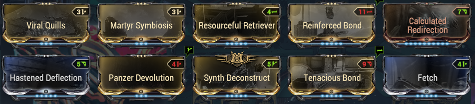
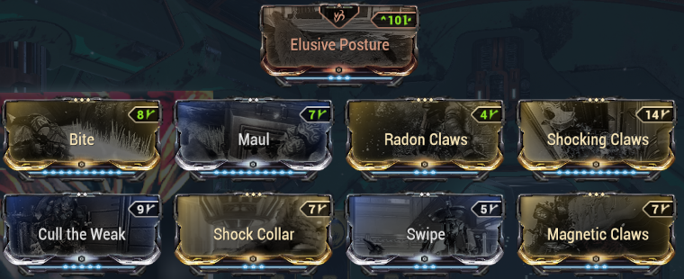
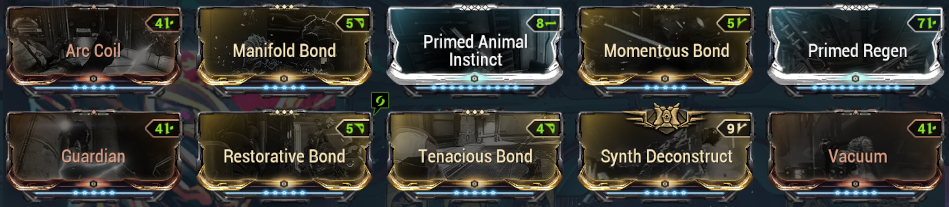
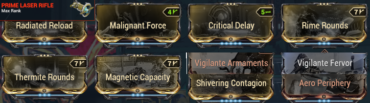
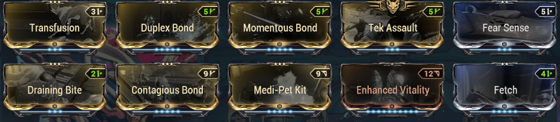
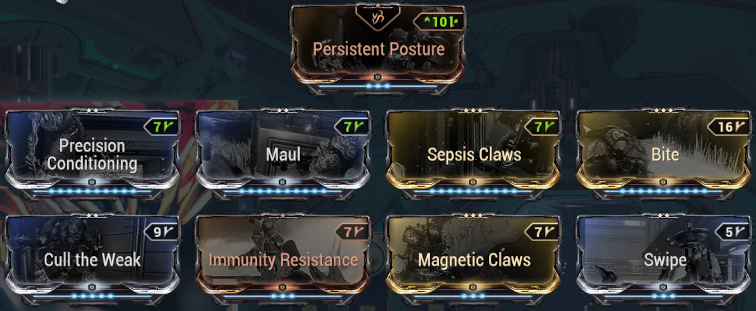

The [companions](https://wiki.warframe.com/w/Companion) are distinguished mainly by the [companion mods](https://wiki.warframe.com/w/Companion_Mods) exclusive to them, as well as access to different weapons. Remember to get the priority mods among the mods listed in [Mods](../mods/index.md).

They complement your builds via different bonuses:

??? note "Utility pets: double-loot, energy, CC"

    - **resource vacuum** ([Vacuum](https://wiki.warframe.com/w/Vacuum) / [Fetch](https://wiki.warframe.com/w/Fetch))
    - **Enemy / resource radar** ([Animal Instinct](https://wiki.warframe.com/w/Animal_Instinct) / [Primed Animal Instinct](https://wiki.warframe.com/w/Primed_Animal_Instinct)
    - **boost [loot](https://wiki.warframe.com/w/Category:Retriever_Mods) resources / credits**
    - survivability
    - **[energy](warframes.en.md#energy) generation**: [Synth Deconstruct](https://wiki.warframe.com/w/Synth_Deconstruct) / [Dig](https://wiki.warframe.com/w/Dig) / [Energy Generator](https://wiki.warframe.com/w/Energy_Generator) / [Archon Stretch](https://wiki.warframe.com/w/Archon_Stretch) + [Arc Coil](https://wiki.warframe.com/w/Arc_Coil) or electric claw mod
    - control:
        - skills: [Arc Coil](https://wiki.warframe.com/w/Arc_Coil) from Diriga
        - weapons: [Tazicor](https://wiki.warframe.com/w/Tazicor) + [Duplex Bond](https://wiki.warframe.com/w/Duplex_Bond) + CC status (fire / cold / electric)
    - [priming](weapons.md/#priming)
    - anti-status
    - etc...

??? note "DPS pets"

    - DPS of companions themselves
    - Buff of warframe weapons:
        - [Tenacious Bond](https://wiki.warframe.com/w/Tenacious_Bond) +1.2x crit damage
            - compatible:
                - all animal companions with [Bite](https://wiki.warframe.com/w/Bite) or [Hunter Synergy](https://wiki.warframe.com/w/Hunter_Synergy) if needed
                - sentry weapons WITHOUT riven: Prime Laser Rifle, Vulcax, Vulklok, Burst Laser Prime
              - sentry weapons WITH riven: Verglas Prime
        - [Reinforced Bond](https://wiki.warframe.com/w/Reinforced_Bond) +60% fire rate
            - Do NOT rely on the internal mod recharge to exceed 1200: bugged if you are not host in a party
            - companions exceeding 1200 shields with [Calculated Redirection](https://wiki.warframe.com/w/Calculated_Redirection): Wyrm Prime, Nautilus Prime, Huras Kubrow, Raksa Kubrow, Sunika Kubrow, all vulpaphylas and Predasites, all [Moa](https://wiki.warframe.com/w/MOA_(Companion)#Final_Stats)/[Hounds](https://wiki.warframe.com/w/Hound_(Companion)) with shield-oriented parts

-------------

## **Companions: Essential**
The basics, the ones to build/use as priority. Companions with AoE and survival skills that help a lot. An AoE + [Synth Deconstruct](https://wiki.warframe.com/w/Synth_Deconstruct) allows generating health orbs, and energy if your frame has [Equilibrium](https://wiki.warframe.com/w/Equilibrium) or a [shard](https://wiki.warframe.com/w/Archon_Shard) purple.

### **Panzer Vulpaphyla** 
{ width="120" align=right }

!!! note "Panzer: advantages"
    - sends viral everywhere ([Viral Quills](https://wiki.warframe.com/w/Viral_Quills) / [Panzer Devolution](https://wiki.warframe.com/w/Panzer_Devolution))
    - sometimes prevents death ([Martyr Simbiosis](https://wiki.warframe.com/w/Martyr_Symbiosis))
    - animal companion so can use "[Retriever](https://wiki.warframe.com/w/Category:Retriever_Mods)" mods to boost your farming

??? note "Acquisition"
    - go to [Cambion Drift](https://wiki.warframe.com/w/Cambion_Drift) on [Deimos](https://wiki.warframe.com/w/Deimos) during the Fass period (Deimos day/night cycle)
    - buy a [Tranq rifle](https://wiki.warframe.com/w/Tranq_Rifle) from [The Business](https://wiki.warframe.com/w/The_Business) or [Son](https://wiki.warframe.com/w/Son), equip it in your consumable wheel in your Arsenal (2nd tab at top left)
    - search and capture via [conservation](https://wiki.warframe.com/w/Conservation) a [Weakened Panzer](https://wiki.warframe.com/w/Vulpaphyla_(Conservation)). To be weakened, the Panzer must have been attacked by an Infested. You can do bounties and sometimes get already weakened capturable ones without effort... otherwise actively search via the Tranq Rifle zoom which indicates nearby enemies (beep + arrows)
    - bring your weakened Panzer for revification to [Son](https://wiki.warframe.com/w/Son) in the Necralisk with an Antigen and a Mutagen of your choice (blueprints sold by Son, to craft in your Foundry)

??? note "Panzer: build"
    Panzer Build:
    
    ----
    Panzer Claws Build:
    

### **Diriga**
{ width="120" align=right }

!!! note "Diriga: advantages"
    - electric stun AoE with [Arc Coil](https://wiki.warframe.com/w/Arc_Coil)
    - can take "Guardian" to regen your shields
    - take weapon with lots of status to inflict status with [Manifold Bond](https://wiki.warframe.com/w/Manifold_Bond) (priming)
    - ??? note "diriga: recommended weapon"
        - [Prime Laser Rifle](https://wiki.warframe.com/w/Prime_Laser_Rifle), has all melee Impact Puncture Slash status + can easily have +50% crit to unlock [Tenacious Bond](https://wiki.warframe.com/w/Tenacious_Bond)
        - or just a Verglas viral/fire to explode enemies (or nuke a room with Contagious + Manifold + Momentous Bond)

??? note "Diriga: Obtention"
    Purchasable for credits in the [Market](https://wiki.warframe.com/w/Market) of your orbiter.

??? note "Diriga: build"
    Diriga Build:
    
    ----
    Diriga Weapon Build (Prime Laser Rifle):
    

### **Vasca Kavat**
{ width="120" align=right }

!!! note "Vasca: advantages"
    - good safety (rez via [Transfusion](https://wiki.warframe.com/w/Transfusion))
    - very good damage allowing energy orb generation via [Duplex Bond](https://wiki.warframe.com/w/Duplex_Bond)
    - access to [Retriever](https://wiki.warframe.com/w/Category:Retriever_Mods) mods
    - access to Kavat mod [Swipe](https://wiki.warframe.com/w/Swipe) for a bit of AoE: +DPS & compatibility with [Synth Deconstruct](https://wiki.warframe.com/w/Synth_Deconstruct)
  

??? note "Acquisition"
    - upgrade your Incubator with [the Kavat Upgrade Segment](https://wiki.warframe.com/w/Orbiter_Segments#Kavat_Incubator_Upgrade_Segment) (blueprint in the Dojo in Tenno Lab or drop in Grineer missions). Requires an [Argon Crystal](https://wiki.warframe.com/w/Argon_Crystal) which drops only in the [Void](https://wiki.warframe.com/w/Argon_Crystal) and 60,000 Alloy Plates, see [Resources](../farm/resources.md) for good spots
    - genetic codes will be a limiting factor.
    - the best place to scan kavats is the 2nd stage of the [Inaros quest](https://wiki.warframe.com/w/Sands_of_Inaros) doable only once
    - other farming location: Formido on Deimos (Sabotage)
    - plan for control that doesn't deal damage and immobilizes (Ivara's arrow, Equinox night mode 2)
    - if possible use the [Synthesis Scanner](https://wiki.warframe.com/w/Synthesis_Scanner) with speed and double scan upgrades (can double drops in this case). Stack [loot boosters](../farm/resources.md/#boosters) if possible
    - Vasca-specific steps:
        - use previously raised Kavats
        - take them at night on Earth in the Plains of Eidolon, cross wild Vasca Kavats and let your Kavat get infected (red aura)
        - recover the genetic imprint of your infected Kavat in the Incubator
        - repeat to get 2 Vasca genetic imprints
        - incubate a kavat by adding the 2 Vasca imprints

??? note "Vasca: build"
    Vasca Build:
    
    ----
    Vasca Claws Build:
    

-------------

## **Companions: Notable**

Less versatile than the Essentials, they can complete a build or fulfill a particular function via their niche abilities.

!!! note "Smeeta Kavat: NO LONGER PROVIDES RESOURCE LOOT BUFF"
    This has been exported and generalized to all [Retriever](https://wiki.warframe.com/w/Category:Retriever_Mods) mods for animal companions.

- **[Nautilus Prime](https://wiki.warframe.com/w/Nautilus/Prime)**: **auto-grouping** of enemies with [Cordon](https://wiki.warframe.com/w/Cordon), gives access to the sentry weapon [Verglas Prime](https://wiki.warframe.com/w/Verglas_Prime) very strong in viral/fire
- **[Smeeta Kavat](https://wiki.warframe.com/w/Smeeta_Kavat)**: random buffs via [Charm](https://wiki.warframe.com/w/Charm). Essentially used for **300% affinity/XP buff**.
- [**Hounds**](https://wiki.warframe.com/w/Hound_(Companion)) from Tenet Lich: Big **DPS/AoE Nuke** capacity + niche utility mods + access to robotic mods ([Guardian](https://wiki.warframe.com/w/Guardian))
- [Huras Kubrow](https://wiki.warframe.com/w/Huras_Kubrow): **partial invisibility** ([Stalk](https://wiki.warframe.com/w/Stalk) + DPS (Paris Prime Incarnon stat-stick + [Hunter Synergy](https://wiki.warframe.com/w/Hunter_Synergy) + [Mecha Overdrive](https://wiki.warframe.com/w/Mecha_Overdrive) + slash/fire crit claws)
- [Shade Prime](https://wiki.warframe.com/w/Shade/Prime): **partial invisibility** ([Ghost](https://wiki.warframe.com/w/Ghost)), dies less often than Huras because less aggro / follows frame
- [Dethcube Prime](https://wiki.warframe.com/w/Dethcube/Prime): **energy** generation ([Energy Generator](https://wiki.warframe.com/w/Energy_Generator))
- [Wyrm Prime](https://wiki.warframe.com/w/Wyrm/Prime): **auto-removal of received status** via [Negate](https://wiki.warframe.com/w/Negate), very good addition for survivability

--------------

## **Companions: Niche**

Not useless but much less versatile than the others. For experts only.

- [Pharaoh Predasite](https://wiki.warframe.com/w/Pharaoh_Predasite): **+100% toxin damage** on your weapons (which does not merge with your mods) via [Anabolic Pollination](https://wiki.warframe.com/w/Anabolic_Pollination)
- [Adarza Kavat](https://wiki.warframe.com/w/Adarza_Kavat): provides **60% final crits** with [Cat's Eye](https://wiki.warframe.com/w/Cat%27s_Eye), stacks in addition to weapon crit from mods, always gives 60% total (like [Arcane Avenger](https://wiki.warframe.com/w/Arcane_Avenger) which gives 45%). Very good on weapons with low base crit that's hard to increase via mods.
- [Chesa Kubrow](https://wiki.warframe.com/w/Chesa_Kubrow): gives an **additional loot chance** on corpses with [Retrieve](https://wiki.warframe.com/w/Retrieve) (works like Nekros). Used for opening apothics.
- [Raksa Kubrow](https://wiki.warframe.com/w/Raksa_Kubrow): **gives back shields + increases shield regen** via [Protect](https://wiki.warframe.com/w/Protect). Scales with its own shields so a frame with lots of shields + [Link Redirection](https://wiki.warframe.com/w/Link_Redirection): top with Hildryn
- [Oxylus](https://wiki.warframe.com/w/Oxylus): **auto-scan of plants** for apothics ([Botanist](https://wiki.warframe.com/w/Botanist), good for passive farming if you rush maps for relics (not recommended for fishing/mining despite its precepts, better to take an animal that can equip a retriever mod and doubles resources)
- [Helios Prime](https://wiki.warframe.com/w/Helios/Prime): automatic scanning for the **codex** ([Investigator](https://wiki.warframe.com/w/Investigator) + access to melee glaive weapon [Deconstructor](https://wiki.warframe.com/w/Deconstructor)
- [Sahasa Kubrow](https://wiki.warframe.com/w/Sahasa_Kubrow): provides **ammo and energy orbs** via [Dig](https://wiki.warframe.com/w/Dig)
- [Carrier Prime](https://wiki.warframe.com/w/Carrier/Prime): provides **ammo** via [Ammo Case](https://wiki.warframe.com/w/Ammo_Case)
- [Sly Vulpaphyla](https://wiki.warframe.com/w/Sly_Vulpaphyla): boosts survival with [Survival Instinct](https://wiki.warframe.com/w/Sly_Vulpaphyla) mod which resets enemy aggro. Also has access to general Vulpa mods like [Martyr Simbiosis](https://wiki.warframe.com/w/Martyr_Symbiosis)
- [Moa](https://wiki.warframe.com/w/MOA_(Companion)): can equip sentry weapons (Verglas Prime, Tazicor), use robotic mods ([Guardian](https://wiki.warframe.com/w/Guardian)) and have niche utility mods. Notable mods: pet survival [Blast Shield](https://wiki.warframe.com/w/Blast_Shield), grouping [Whiplash Mine](https://wiki.warframe.com/w/Whiplash_Mine), area tanking/defense [Stasis Field](https://wiki.warframe.com/w/Stasis_Field), **auto-hack** [Security Override](https://wiki.warframe.com/w/Security_Override) (allows hacking through windows via [Master's Summons](https://wiki.warframe.com/w/Master%27s_Summons))