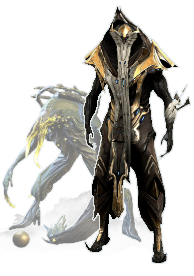
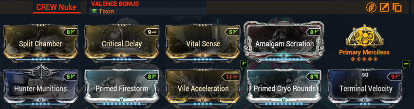

{ width="250" align=right }

Les spectres sont des IA alliées que vous pouvez invoquer en mission pour vous aider. 

Certains sont très utiles et faciliteront énormément les défis de multiples modes de jeu : ça vaut le coup de les préparer à l'avance !

Il y a différents spectres :

- [spectres de Tenno](https://wiki.warframe.com/w/Specter_(Tenno))
- [spectres de syndicat](https://wiki.warframe.com/w/Specter#Syndicate_Specters)
- [crewmates (on-call)](https://wiki.warframe.com/w/On_Call_Crew)
- spectres de compétences (Equinox, Wukong, Excalibur Umbra), qui ne seront pas traités ici

-------------

-------------

## **Spectres de Tenno**

On distingue **4 rangs** de spectres de Tenno :

- aucune différence de puissance (elle est déterminée par le niveau des ennemis actuels à l'invocation)
- permet d'avoir 4 spectres / loadouts différents
- les spectres de bas rang en construisent plus à la fois (x10 par craft pour rang 1, 1 seul par craft pour rang 4) : configurer en bas rang ceux que vous allez souvent jouer

**Limitations** :

- n'utilisent pas tous les [pouvoirs](https://wiki.warframe.com/w/Specter_(Tenno)#Crafted) 
- n'ont pas de mods équipés sur la frame ni les armes (MAIS profitent de l'aura [don de puissance](https://wiki.warframe.com/w/Power_Donation) et de l'aura de puissance de [Jade](https://wiki.warframe.com/w/Symphony_of_Mercy))
- gèrent mal les armes à munition (on préférera les armes à batterie)

!!! note "Acquisition des blueprints"
    - faire des missions de capture de [différents niveaux](https://wiki.warframe.com/w/Specter_(Tenno)#Acquisition)
    - acheter directement des blueprints de base chez [Nightcap](https://wiki.warframe.com/w/Nightcap) sur Fortuna

-------------

### Loadouts conseillés

#### Warframes conseillées 

- **Dante** : protection, buffs dégats, principalement le buff overguard de [Triomphe](https://wiki.warframe.com/w/Final_Verse) qui regen de l'overguard en continu après avoir tué des ennemis
- **Wisp** : regen vie/vitesse
- **Protea** : regen vie/énergie/munition, invoque son dispensaire
- **Nidus** : boost puissance multiplicatif, applique son lien dès l'invocation. Surtout utilisé en contenu optimisé haut niveau et statique (Défenses, Arbitrages)
- **Citrine** : survie, applique sa réduction de dégats. Cumule avec les autres Citrines présentes
- Cyte : fournit des munitions élémentaires pour les armes. Utile avec l'ocuccor pour garder un même élément en permanence (l'arme se recharge à chaque kill sans changer de chargeur)

#### Armes conseillées

- primaire : [Shedu](https://wiki.warframe.com/w/Shedu) (batterie, stun aoe régulier)
- secondaire : [Tenet Cycron](https://wiki.warframe.com/w/Tenet_Cycron) (batterie, procs feu natifs)
- mếlée : [mk1 furax](https://wiki.warframe.com/w/Mk1-Furax) (portée minuscule, favorisera les autres armes)

!!! note "Utilisation"
    - fabriquer vos spectres à la fonderie
    - équiper vos spectres dans votre roue des consommables de l'[Arsenal](https://wiki.warframe.com/w/Arsenal)
    - utiliser vos spectres via roue des consommables en jeu
 

-------------

## **Spectres de Syndicat**

On se focalisera essentiellement sur le spectre de l'[Ancien Protecteur](https://wiki.warframe.com/w/Ancient_Protector) du Nouveau Loka : il redirige vers lui 90% des dégats des alliés, objectifs de défense compris !

Il donne aussi une immunité au stagger / knockdown (tomber à terre) pour les alliés proches.

-------------

## **Crewmate (on-call)**

Débloqué avec le commandement du [Railjack](https://wiki.warframe.com/w/Command_Intrinsic) au rang 9.

On préférera le rang 10 pour obtenir des crewmates Elite avec des passifs boostant encore plus leurs dégats (buff préféré : 150% chances de crit sur armes primaires).

Se recrutent chez [Ticker sur Fortuna](https://wiki.warframe.com/w/Ticker#Elite_Crew) ou sur la [Tour Pontis](https://wiki.warframe.com/w/Railjack/Crew#Unique_Elite_Crew) (recruter Jarka Lar).

Il faut les équiper sur le railjack via un [Dock](https://wiki.warframe.com/w/Railjack#Dry_Dock) (dojo ou relais Saturne / Pluton), monter leurs stats de Combat et d'Endurance, et les sélectionner comme "on-call".
Ensuite pensez à équiper leur raccourci dans la roue des consommables de votre propre Arsenal.

En arme, on préfèrera une arme AoE ayant une mauvaise économie de munitions (ces spectres ont des munitions infinies) : le [Kuva Zaar](https://wiki.warframe.com/w/Kuva_Zarr) est le candidat le plus récurrent. Attention, le modding est particulier car certains mods fonctionnent mal.

??? note "Build mods Zarr"
    
