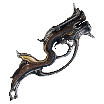

{ width="170" align=right }

# Armes Steelpath

Se focaliser sur **un petit pool d'armes** bien moddées. 

Faire le [circuit steel path](../weekly-checklist.md/#joueurs-confirmes) pour obtenir des [incarnons](#incarnons) (avec les décrets et en groupe ça se fait tôt), voire les [liches](#choix-des-armes-de-liche) pour certaines armes. En dehors du circuit, les armes incarnon du [Zariman](../farm/syndicates.md/#syndicats-a-mini-hubs) sont très bien aussi.

## **Armes conseillées**
Classées par Mastery Rank (MR) pour une meilleure lisibilité. N'indique pas la puissance mais juste le niveau permettant d'y accéder.

!!! note "Le MR minimal peut être trompeur"

    - les [kitguns](https://wiki.warframe.com/w/Kitgun) nécessitent de la réputation, 
    - les adaptateurs incarnons nécessitent l'accès au [circuit SP](https://wiki.warframe.com/w/The_Circuit#The_Steel_Path_Circuit),
    - les armes de [liche Tenet/Kuva](#armes-de-liche) 
        - les armes de liche kuva/tenet en "récompense directe" (via fonderie et pas une boutique ingame) ignorent les prérequis en MR, il faut juste le MR 5 + quêtes [War Within](https://wiki.warframe.com/w/The_War_Within) + [Rising Tide](https://wiki.warframe.com/w/Rising_Tide)
        - les missions de liche kuva/tenet se font lvl 55-110... mais techniquement accessible tôt, indiquées par une étoile *

- **primaires** :
      - MR 0+ : Nataruk, Kitgun Vermisplicer+Brash+Splat, Kitgun Vermisplicer+Brash/palmaris+macro thymoid
      - MR 4 : **Torid** Incarnon
      - MR 5 : Tenet Arca Plasmor*, Tenet Glaxion*
      - MR 8 : Acceltra, Cedo
      - MR 9 : Phantasma non-Prime, Ignis Wraith
      - MR 11 : **Boar Prime** incarnon
      - MR 10 : **Latron Prime** incarnon
      - MR 12 : **Burston Prime** incarnon
      - MR 14 : Acceltra Prime, **Phenmor**, **Felarx**,  Phantasma Prime
      - MR 15 : Cedo Prime
      - MR 17 : Coda Bassocyst 
   
- **secondaires** :
      - MR 0+ : Kitgun (Sporelacer+Haymaker+Splat)
      - MR 2 : **Furis Incarnon**
      - MR 5 : **Kuva Nukor*** ([progéniteur](https://wiki.warframe.com/w/Adversary_System/Progenitor) Magnetic ou Feu), **Tenet Cycron*** Feu, [Tenet Plinx](https://www.youtube.com/watch?v=XJgcrOOc7P0)
      - MR 8 :  **Ocucor** (nécessite un [mod augment](https://wiki.warframe.com/w/Sentient_Surge)), **Lex Prime** Incarnon
      - MR 11 : **Dual Toxocyst Incarnon**
      - MR 14 : **Laetum**, Epitaph Prime (tir primaire = aoe, tir chargé = bombe nucléaire)
   
- **melee** : (arcanes [**Melee Influence**](https://wiki.warframe.com/w/Melee_Influence) / [Melee Exposure](https://wiki.warframe.com/w/Melee_Exposure) dans le doute)
      - MR 6 : **Dual Ichor** Incarnon, Broken War, **Xoris** (glaive explo)
      - MR 8 : Falcor (glaive rebond)
      - MR 9 : Lesion
      - MR 10 : Harmony, Glaive Prime (glaive explo)
      - MR 12 : Guandao Prime, **Thalys** Incarnon, **Okina Prime** Incarnon, Orthos Prime
      - MR 14 : **Praedos** Incarnon

-------------

## **Incarnons**
Tous les [incarnons](https://wiki.warframe.com/w/Incarnon) ont du potentiel, mais certains sont plus efficaces dans l'état actuel du jeu et/ou plus agréables à jouer de manière génèrale.

!!! note "checklist pré-requis OBLIGATOIRES pour obtenir une arme incarnon"
    - Incarnons Zariman : quête [Anges du Zariman](https://wiki.warframe.com/w/Angels_of_the_Zariman)
    - Incarnons du Sanctum : quête [Murmures dans le mur](https://wiki.warframe.com/w/Whispers_in_the_Walls) + [Deadlock Protocol](https://wiki.warframe.com/w/The_Deadlock_Protocol)
    - Incarnons de Duviri : quête [Paradoxe de Duviri](https://wiki.warframe.com/w/The_Duviri_Paradox) + [SteelPath](https://wiki.warframe.com/w/The_Steel_Path)

### **Incarnons prioritaires**
Dans le doute, opter pour les incarnons suivants :

- **natifs** (sans adaptateur) :
      - **primaires** / **secondaires** du Zariman:  Felarx, Phenmor, Laetum
      - **mêlée** :
         - Zariman : Praedos (surtout pour la vitesse, DPS OK), Innodem (correct)
         - Duviri : Thalys (bonne range / combo Influence)
- **adaptateurs** dans le [circuit Duviri Steel Path](https://wiki.warframe.com/w/The_Circuit#The_Steel_Path_Circuit) (tip circuit SP : récupérer une arme (mêlée prio) avec condition overload ou galvanized shot/aptitude et prendre des décrets de dmg élémentaire) :
      - primaires / secondaires : Torid, Dual toxocyst, Furis, Burston, Boar, Lex Prime
      - mếlée : Dual Ichor, Okina Prime, Nami Solo, Hate, Bo Prime, Magistar

??? note "Circuit SP : Armes incarnon prioritaires par rotation hebdo"

      - semaine 1 : Lato, Paris
      - semaine 2 : Boar, Angstrum
      - semaine 3 : Furis, Latron, Strun, Bo
      - semaine 4 : Magistar, Lex, Boltor
      - semaine 5 : Torid, Dual Toxocyst, Dual Ichor, Miter
      - semaine 6 : Burston, Nami Solo, Vasto
      - semaine 7 : Hate, Dread
      - semaine 8 : Okina, Dera, Sybaris, Sicarus

### **Choix des armes pour adaptateurs**
Les adaptateurs sont compatibles avec plusieurs armes, les bonus sont légèrement différents selon les armes. Se référer aux pages respectives des armes via le [détail des incarnons](https://wiki.warframe.com/w/Incarnon)

!!! note "Adaptateurs primaires"

      - _prime_ : Boar, Boltor, Braton, Gorgon, Latron, Paris, Strun, Sybaris 
      - _vandal_ : Dera
      - _prisma_ : Gorgon
      - _pas le choix_ : Dread, Miter, Torid

!!! note "Adaptateurs secondaires"

      - _prime_ : Bronco, Lato (fondateur), Lex, Sicarus, Vasto, Zylok
      - _normal_ (non mk-1) : Furis
      - _prisma_ : Angstrum 
      - _synoid_ : Gammacor
      - _vandal_ : Lato
      - _pas le choix_ : Atomos, Cestra, Despair, Dual Toxocyst

!!! note "Adaptateurs mếlée"

      - _prime_ : Bo, Okina, Skana (fondateur)
      - _normal_ : Magistar (pas le sancti)
      - _wraith_ : Furax 
      - _prisma_ : Skana
      - _pas le choix_ : Ack & Brunt, Anku, Ceramic Dagger, Dual ichor, Hate,  Nami Solo, Sibear

-------------

## **Armes de liche**
Beaucoup d'armes possibles, certaines plus sympa que d'autres. 
3 différents types de liches à ce jour :

- grineer : [liche kuva](https://wiki.warframe.com/w/Kuva_Lich)
- corpus : [soeur de parvos](https://wiki.warframe.com/w/Sisters_of_Parvos)
- infestés : [technocyte coda](https://wiki.warframe.com/w/Technocyte_Coda)

!!! note "Checklist pré-requis OBLIGATOIRES pour obtenir une liche"

    - être [MR 5](../beginner/mastery-rank.md) (depuis l'[update 35](https://wiki.warframe.com/w/Update_35#Update_35.0) de 2023)
    - avoir fait les quêtes [War Within](https://wiki.warframe.com/w/The_War_Within) + [Rising Tide](https://wiki.warframe.com/w/Rising_Tide)
    - ne pas avoir de liche active (on ne peut en faire q'une à la fois)
        - pour vérifier : aller dans le menu du jeu et voir en bas à droite si vous avez un bouton rouge/bleu/vert à côté de vos Ondes Nocturnes (Nightwave)

!!! note "MR requis affiché et réel"

      Il faut bien séparer 2 types d'armes de liche :

    - **armes de liche obtenues dans la fonderie** après combat (liches kuva + tenet)
        - ignorent les prérequis en MR, il faut juste les pré-requis MR 5 + [War Within](https://wiki.warframe.com/w/The_War_Within) + [Rising Tide](https://wiki.warframe.com/w/Rising_Tide)
    - **armes de liche obtenues dans une boutique ingame** contre des jetons (armes coda + tenet chez Ergo Glast)
        - suivent les règles normales de prérequis MR pour obtenir l'arme
            - au MR 16 on a débloqué toutes les armes [Tenet d'Ergo Glast](https://wiki.warframe.com/w/Ergo_Glast#Tenet_Weapons) (MR 14 à 16 selon les armes)
            - au MR 17 on a débloqué toutes les armes [Coda](https://wiki.warframe.com/w/Coda_Weapons) d'Eleanor (MR 17 pour toutes)

### **Status / progéniteurs**
Les armes de liche bénéficient d'un bonus de dégats/statuts de +20 à +60%, dont le statut est déterminé par la frame qui a généré la liche (larve, candidat...). On appelle cette frame le progéniteur.

#### **Types de status**
Voir la [liste des progéniteurs](https://wiki.warframe.com/w/Kuva_Lich/Progenitor) pour plus de détails.
Exemple : utiliser Saryn pour avoir une arme toxine, Nezha pour une arme feu, Mesa pour une arme magnétique.

Ces status sont moins critiques à la création d'une arme que par le passé : ils peuvent être changés avec un [Elemental Vice](https://wiki.warframe.com/w/Elemental_Vice).

!!! note "Status opti : Kuva / Tenet"
      Voir la liste des [status conseillés](https://i.hep.gg/NemesisProgenitors).

??? note "Status opti : Coda"

    Peuvent changer selon la meta/l'état des connaissances, juste de manière indicative :

    - **primaires** :
        - _Bassocyst_ : **Froid/Feu** (faire du Blast)
        - _Hema_ : **Magnetic**
        - _Sporothix_ : **Elec** (but : blast + elec)
        - _Synapse_ : **Feu** (but : Corro / Blast ou Corro/Feu)
    - **secondaires** :
        - _Tysis_ : **Magnetic**
        - _Pox_ :  **Froid** (but : Corro / Blast avec Primed Heated Charge)
        - _Dual Coda Torxica_ : **Elec** OU **Feu** (but : Feu viral, Elec viral)
        - _Catabolyst_ : **Feu** (but : Corro+Feu+Viral)
    - **mêlée** :
        - Patho_cyst :  **Elec** (Blast + Elec Influence)
        - _Mire_ : **Elec** (Gas+Elec Influence) ou feu (Gas Afflictions)
        - _Hirudo_ : **Elec** (Viral+Elec Influence)
        - _Caustacyst_ : **Elec** (Viral+Elec Influence)
        - _Motovore_ : **Impact** (Corro Exposure) ou **Elec** (Influence)

#### **Pourcentages de status**

Pour les armes en boutique (Coda, Tenet Ergo Glast), pour réduire le nombre de fusion avant le maximum, visez des armes [avec les % suivants](https://wiki.warframe.com/w/Kuva_Weapons#Elemental_Bonus) :

   - directement 60% (heh)
   - 52.8% (juste 1 fusion avant max)
   - 48% (2 fusions avant max)

### **Choix des armes de liche**
L'essentiel est présent dans les [armes conseillées](#armes-conseillees).

#### **[Armes Kuva (grineer)](https://wiki.warframe.com/w/Kuva_Weapons)**

!!! note "Armes Kuva par ordre de priorité"

      - _prio_ : Kuva Nukor
      - _niche meta_ : Kuva Hek, Kuva Ogris, Kuva Sobek, Kuva Zarr, Kuva Bramma
      - _niche non-meta_ : Kuva Kohm, Kuva Hind, Kuva Quartakk, Kuva Tonkor, Kuva Chakkhurr
      - _autres_:  Kuva Drakgoon, Kuva Hind, Kuva Karak, Brakk, Kraken, Seer, Twin Stubbas, Grattler, Kuva Shildeg, Kuva Ayanga

#### **[Armes Tenet (corpus)](https://wiki.warframe.com/w/Tenet_Weapons)**
Ajout des armes Tenet disponibles via [Holokeys](https://wiki.warframe.com/w/Corrupted_Holokey) chez [Ergo Glast](https://wiki.warframe.com/w/Ergo_Glast) en relai, holokeys obtenables en faisant des fissures Railjack, notées d'une étoile *

!!! note "Armes Tenet par ordre de priorité"

      - _prio_ : Tenet Arca Plasmor, Tenet Glaxion, Tenet Cycron
      - _niche meta_ : Tenet Plinx, Tenet Diplos
      - _niche non-meta_ : Tenet Flux Rifle , Tenet Tetra, Tenet Detron, Tenet Envoy, Tenet Exec*
      - _autres_ : Tenet Spirex, Tenet Agendus*, Tenet Livia*, Tenet Grigori*, Tenet Ferrox*

#### **[Armes Coda (infestés)](https://wiki.warframe.com/w/Coda_Weapons)**

!!! note "Armes Coda par ordre de priorité"

      - _prio_ : Coda Bassocyst
      - _niche meta_ : Coda Hema, Coda Synapse, Coda Tysis,  Coda Pathocyst, Dual Coda Torxica
      - _niche non-meta_ : Coda Sporothrix,  Coda Pox, Coda Mire, Coda Hirudo
      - _autres_ : Coda Catabolyst, Coda Caustacyst, Coda Motovore

### **Obtention des armes de liche**
??? note "Liches Grineer (Kuva)"

      -  être MR5 minimum, avoir fait la [Guerre Intérieure](https://wiki.warframe.com/w/The_War_Within)
      -  faire apparaitre un [Kuva Larvling](https://wiki.warframe.com/w/Kuva_Larvling) dans des missions grineer lvl 20+, de préférence en solo sur Cassini (Saturne)
      -  les missions à effectuer sont :
         - de niveau 55 à 110 selon le niveau de votre liche
         - lieux : terre, mars, ceres, sedna, forteresse kuva (missions + [reliques requiem](https://wiki.warframe.com/w/Void_Relic#Requiem_Relics))
         - faire les missions infestées par la liche en public de préférence (les alliés vous aident à avancer la découverte de vos mots requiem)
      - le niveau requis des armes reçues est ignoré
      - nécessite d'ouvrir les [reliques requiem](https://wiki.warframe.com/w/Void_Relic#Requiem_Relics) obtenues en tuant les thralls de la liche en mission (ou en faisant des alertes siphon kuva) pour obtenir des [mods requiem](https://wiki.warframe.com/w/Requiem_Mods)
      - nécessite d'équiper 3 [mods requiem](https://wiki.warframe.com/w/Requiem_Mods) sur votre Parazon (en bas de l'arsenal), pour tester et trouver la bonne combinaison de 3 mods permettant de vaincre la liche ([guide strat requiem](https://wiki.warframe.com/w/User:Emptylord/Requiem_Guide))
      - une fois la bonne combinaison trouvée, battre la liche en mission railjack sur [Proxima de Saturne](https://wiki.warframe.com/w/Saturn_Proxima). Utiliser Revenant et/ou silence et une arme qui tire vite (Dual Toxocyst Incarnon) pour se faciliter la vie. Tuer la liche pour obtenir son arme.

??? note "Liches Corpus (Soeurs de Parvos / Tenet)"

      - être MR5 minimum, avoir fait la [Guerre Intérieure](https://wiki.warframe.com/w/The_War_Within) et l'[Appel des Tempestarii](https://wiki.warframe.com/w/Call_of_the_Tempestarii)
      - faire apparaître un [Candidat](https://wiki.warframe.com/w/Candidate)
            - faire Hydra (Pluton), pendant la mission récupérer une [Couronne Granum Zenith](https://wiki.warframe.com/w/Granum_Void#Mechanics) sur un [Trésorier](https://wiki.warframe.com/w/Treasurer
            - refaire Hydra (Pluton) en solo de préférence (baisse la difficulté du Granum Void)
            - donner la couronne à une grande statue de main dorée (Golden Hand Tribute)
            - battre au minimum le 1er rang dans le Granum Void. 
                  - Utiliser des aoe (mesa/octavia = easy, arme aoe sur une corniche en bord de map...) 
                  - ou le [Xoris](https://wiki.warframe.com/w/Xoris)
      -  les missions à effectuer sont :
         -  de niveau 55 à 110 selon le niveau de votre liche
         -  lieux : venux, phobos, jupiter, neptune, pluton (+forteresse kuva pour ouvrir vos [reliques requiem](https://wiki.warframe.com/w/Void_Relic#Requiem_Relics))
         -  faire les missions infestées par la liche en public de préférence (les alliés vous aident à avancer la découverte de vos mots requiem)
      - le niveau requis des armes reçues est ignoré
      - nécessite d'ouvrir les [reliques requiem](https://wiki.warframe.com/w/Void_Relic#Requiem_Relics) obtenues en tuant les thralls de la liche en mission (ou en faisant des alertes siphon kuva) pour obtenir des [mods requiem](https://wiki.warframe.com/w/Requiem_Mods)
      - nécessite d'équiper 3 [mods requiem](https://wiki.warframe.com/w/Requiem_Mods) sur votre Parazon (en bas de l'arsenal), pour tester et trouver la bonne combinaison de 3 mods permettant de vaincre la liche ([guide strat requiem](https://wiki.warframe.com/w/User:Emptylord/Requiem_Guide))
      - une fois la bonne combinaison trouvée et l'antivirus à 100%, battre la liche en mission railjack sur [Proxima de Neptune](https://wiki.warframe.com/w/Neptune_Proxima). Utiliser Revenant et/ou silence et une arme qui tire vite (Dual Toxocyst Incarnon) pour se faciliter la vie. Tuer la liche pour obtenir son arme.

??? note "Liches Infestées (Coda)"

      - il n'y a pas de MR minimum, il faut avoir fait la quête [Hex](https://wiki.warframe.com/w/The_Hex_(Quest)) (dernière quête principale actuellement).
      - niveau de maîtrise de 17 requis pour acheter les armes coda
      - les missions à effectuer sont les missions de [1999 Hôllvania](https://wiki.warframe.com/w/H%C3%B6llvania) :
         - faire apparaître la liche en faisant une mission rapide ([Legacyte Harvest](https://wiki.warframe.com/w/Legacyte_Harvest)), en solo de préférence
         - faire des [bounties tiers 7](https://wiki.warframe.com/w/Bounty#H%C3%B6llvania_Central_Mall_Bounties_(H%C3%B6llvania)) pour dropper des mods [Antivirus](https://wiki.warframe.com/w/Antivirus_Mods)
         - faire les nodes de 1999 indiqués par un contour vert avec tentacules, attaquer et utiliser le parazon sur les liches pour tester vos Antivirus
      - nécessite seulement 1 Antivirus valable pour battre une liche, on peut les tester 3 par 3 puis changer les inutiles pour des mods de [Potency](https://wiki.warframe.com/w/Potency_Mods) pour booster l'antivirus
      - une fois la bonne combinaison trouvée, battre la liche en mission railjack sur [Proxima de la Terre](https://wiki.warframe.com/w/Earth_Proxima). Utiliser Revenant et/ou silence et une arme qui tire vite (Dual Toxocyst Incarnon) pour se faciliter la vie. Tuer la liche pour obtenir son arme.

## **Priming**
Le [**priming**](https://www.youtube.com/watch?v=oj1SnZOxBp4) consiste à "préparer" des ennemis avec une source de statuts pour qu'une autre arme dégâts bénéficiant de ces statuts le détruise encore plus fort juste après. Gros boost de dégâts en perspective, ça peut permettre de passer un cap (trash mobs Steel Path, mini-boss comme les démolystes en perturbation).

Voir aussi l'interaction avec [les mods CO / GunCO](https://wiki.warframe.com/w/Condition_Overload_(Mechanic)) (**condition overload**/surcharge d'état, galvanized shot, galvanized aptitude).

#### **Primers : Exemples**

  - armes secondaires : Epitaph, Kompressa (Prime), (Coda) Tysis...
  - primaires : Cedo Prime, Bubonico...
  - compagnon :
      - Diriga (voir [Compagnons](pets.md))
      - [Sentinelle](https://wiki.warframe.com/w/Sentinel) / [Moa](https://wiki.warframe.com/w/MOA_(Companion)) + [Tazicor](https://wiki.warframe.com/w/Tazicor) (mini Nukor) + [Duplex Bond](https://wiki.warframe.com/w/Duplex_Bond)

### **Primers : Stats recherchées**

- multishot
- firerate
- chance de status
- [effet de status](https://wiki.warframe.com/w/Status_Effect) :
      - **base** : 
         - Viral / magnetic (un seul mod de 1999) : augmente les dégâts sur la vie / les shields & overguard
         - corro / feu : réduit l'armure des cibles
      - **bonus** : radiation (un seul mod des labos entrati/deimos) : contrôle random + rajout d'un statut via un seul mod pour [CO/GunCo](https://wiki.warframe.com/w/Condition_Overload_(Mechanic))
      - **autres** :
         - cold : ralentir les démolysts + augmente les crit damage reçus (+0.5 multiplicateur crit à 9 stacks)
         - puncture : réduit les dégats ennemis (80% reduc à 5 stacks) + augmente les chances de crit reçus (+25% final crit chance à 5 stacks)
      - **arcanes** : [Secondary Encumber](https://wiki.warframe.com/w/Secondary_Encumber)
